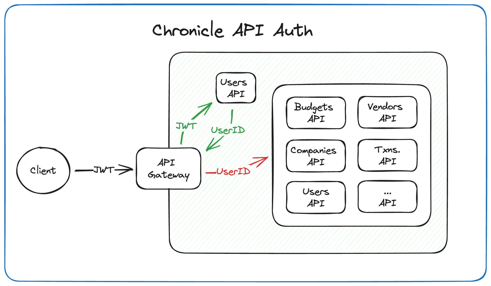

# Chronicle

A microservice based bookkeeping / personal finance application to learn how to integrate Docker, Postgres, K8s, Ruby, Python, and AI models.

## Requirements

- Soft dependencies.  APIs should not directly call other APIs.  Use a message broker, aggregation container, or similar.  Keep APIs independent of each other for better alerting and tracability.
- UUIDs for PKs, controversial but can change it later.
- Next.js frontend.  Server-side components wherever possible, except interactive forms which currently are nested.  Example:
  ```javascript
  // Example Client/Server nesting for dynamic forms
  import ClientComponent from "./ClientComponent";
  import ServerComponent from "./ServerComponent";

  // Pages are Server Components by default
  export default function Page() {
    return (
      <ClientComponent>
        <ServerComponent />
      </ClientComponent>
    );
  }
  ```
  Server component will declare 'use server', client 'use client'.
  Pass children: React.ReactNode object from client to server components.
  ```javascript
  // Client Component
  'use client';

  import { submitForm } from './ServerComponent'

  export default function ClientComponent(
  {
    children
  }: {
    children: React.ReactNode
  }) {

  return (<>
    <div>
      {children}
    </div>
  </>);
  ```
  ```javascript
  // Server Component
  'use server';
  import { redirect } from 'next/navigation';

  export async function submitForm(formData: any) {
    console.log("Form Data:", formData);
  }

  async function ServerComponent() {
    return (
      <>
        <p>Server Component</p>
      </>
    )
  }

  export default ServerComponent;

## Diagrams
### API Auth in K8s

